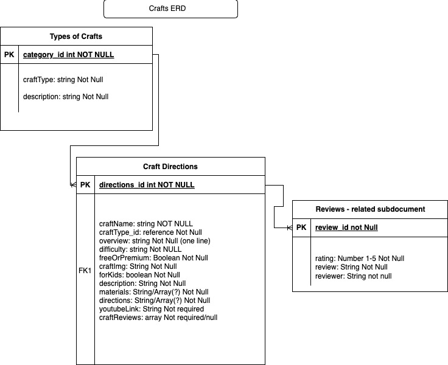
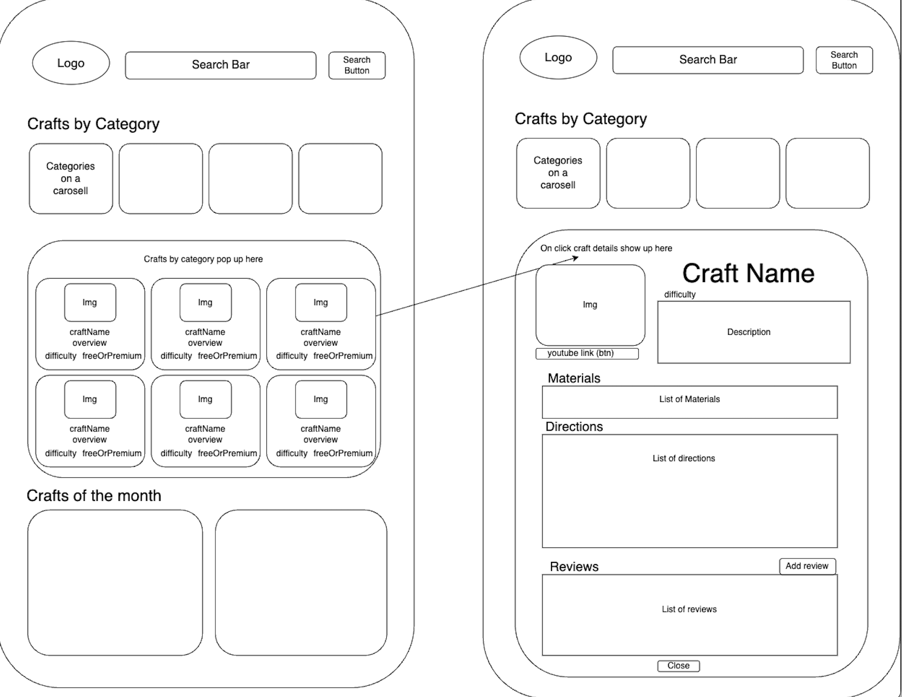

# Craftopia: Your Go-To Resource for Arts & Crafts

## About
Do you ever want to make some art and crafts but don't know where to start? Tired of looking for new crafts only to be bogged down by blog post after blog post? Then welcome to **Craftopia**, the ultimate destination for arts and crafts enthusiasts! Whether you're a beginner or a seasoned crafter, you'll find a wealth of inspiration and practical guidance to create your next masterpiece. Craftopia simplifies the crafting journey by offering a curated database of craft ideas, complete with step-by-step instructions. Say goodbye to endless blog posts and hello to your next DIY project!

## ERD

I want my crafts and types to be seperate collections. Types will be the parent of Crafts. My reviews will be embedded documents within the Craft data and not a seperate collection. Materials and Directions will also be embedded documents within the craft data. 

## Display

I would like my craft types and some other filters to appear as rotating buttons on a carousel. When clicking the button the craft type's collection of crafts should appear on the page. You can then click a craft of your choice and the details will appear. In this details section there will be a review section at the bottom with a button to add reviews. A new div or page should appear to add review. Review should appear after user posts.

## Goals
- **Understand Data Structure:** Gain a deeper understanding of embedded documents vs. related collections in MongoDB and how they apply to crafting entities.
- **Data Retrieval:** Successfully retrieve all requested data from MongoDB using efficient query techniques.
- **User Interaction:** Implement functionality for users to POST new reviews associated with specific crafts.
- **Responsive Design:** Create a well-styled, responsive web page that enhances user experience across devices.
- **Search Functionality:** Develop a search feature that displays crafts based on user-defined search terms.

## Challenges
- **Seeding data:** Needed to address issue of certain fields being required.
- **Carousel:**Getting the carousel to display all buttons
- **Class/ID Optimization:** Getting into the CSS and mixing Classes and IDs
- **Correctly Posting Review:** Thinking through how I would pull the craftID to link to review to properly post. 

## Learnings
Throughout the development process, I have gained valuable insights, including:

- Mastering innerHTML and dynamic element creation in JavaScript.
- Divs are incredible. 
- Linking to other HTML pages and new HTML form elements
- How to loop through divs to create a carousel effect
- The importance of utilizing classes in CSS to reduce redundancy and enhance maintainability.

## Stretch goals
To further enhance Craftopia, I plan to implement the following features:

- **Improved Carousel**: Refine the carousel design for better user interaction.
- **Dynamic Refresh**: Enable the review section to refresh and display new reviews without page reloads.
- **Additional HTML Pages**: Expand the site with more informative pages related to crafting.
- **User Submission Feature**: Allow users to submit their own craft ideas.
- **Mobile-Friendly Enhancements**: Improve usability on various devices.
- **Code Refactoring**: Rework class and ID structures for better organization.

## Resources used
- **ChatGPT**: Assisted in debugging and generating dummy craft data. (Sorry about the weird hands!)
- **W3 Schools & MDN Web Docs**: Provided resources for CSS styling and carousel implementation.
- **MongoDB Documentation**: Offered insights into embedded vs. related documents.
- **Hackathon Project**: Fostered collaboration and exposure to team code.

